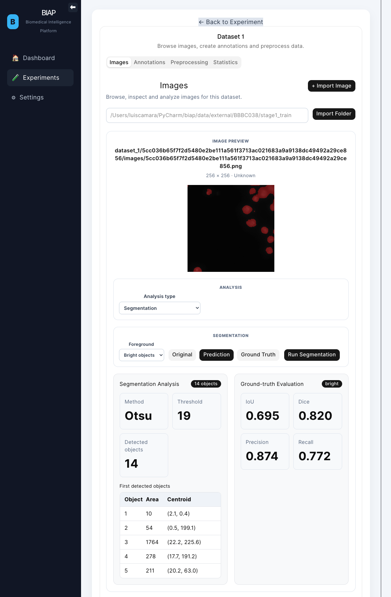

# BIAP

# Biomedical Image Analysis Platform



**BIAP** is an open-source platform for quantitative biomedical image analysis and AI-assisted scientific workflows.

The current implementation provides a modular image analysis workspace for microscopy datasets, supporting image exploration, classical computer vision, quantitative evaluation, and an architecture designed to grow toward modern AI-driven biomedical research.

Rather than being a collection of isolated tools, BIAP is designed as a modular scientific platform supporting reproducible experiments, interpretable AI models, and interactive exploration of biomedical datasets.

---

# 🚧 Current Status

> **This project is under active development.**

The platform has completed the first stage of the Computer Vision module.

## Current milestone

### Image Analysis Workspace v2

The current workspace provides an interactive environment for biomedical image analysis, including image visualisation, segmentation, quantitative evaluation, and dataset navigation.

Implemented

- ✅ FastAPI backend
- ✅ React frontend
- ✅ Dataset management
- ✅ Biomedical image browser
- ✅ BBBC038 dataset support
- ✅ Modular Image Analysis Workspace
- ✅ Otsu image segmentation
- ✅ Prediction overlays
- ✅ Ground-truth overlays
- ✅ Quantitative segmentation evaluation

---

# Current Features

## Dataset Management

- Import biomedical image datasets
- Folder-based dataset registration
- Thumbnail generation
- Dataset browsing
- High-resolution image preview

---

## Image Analysis Workspace

Current analysis module

### Segmentation

Implemented functionality

- Otsu threshold segmentation
- Bright/Dark foreground detection
- Prediction overlay visualisation
- Ground-truth overlay visualisation
- Connected component analysis
- Region measurements

Automatic evaluation

- Intersection over Union (IoU)
- Dice coefficient
- Precision
- Recall

The frontend is organised around a modular image analysis architecture, allowing future analysis techniques to be added independently.

Planned analysis modules

- Morphology
- Texture Analysis
- Intensity Analysis
- Feature Extraction
- Deep Learning Segmentation

---

# Architecture

```
React Frontend
        │
        ▼
FastAPI Backend
        │
 ┌─────────────┬──────────────┬──────────────┬──────────────┐
 │             │              │              │
 Dataset     Vision         ML Engine      AI Engine
 Manager     Engine         (future)       (future)
        │
        ▼
 Experiment Manager
        │
        ▼
 Results / Models / Reports
```

The frontend communicates exclusively through REST APIs and is organised around reusable image-analysis components.

The Vision Engine is implemented as independent modules, allowing new computer vision algorithms to be integrated without redesigning the application.

---

# Technology Stack

## Backend

- Python
- FastAPI
- NumPy
- scikit-image
- OpenCV

## Frontend

- React
- Vite
- shadcn/ui

## AI & Scientific Computing

Current

- NumPy
- scikit-image

Planned

- PyTorch
- MONAI
- PyTorch Geometric
- Hugging Face Transformers

---

---

# Installation

## Prerequisites

- Git
- Python 3.12+
- Node.js 20+
- npm

Clone the repository:

```bash
git clone https://github.com/Chicone/biap.git
cd biap
```

---

## Backend Setup

Create and activate a Python environment.

Using Conda:

```bash
conda create -n biap python=3.12
conda activate biap
```

Or using a virtual environment:

```bash
python -m venv .venv
```

Linux/macOS:

```bash
source .venv/bin/activate
```

Windows:

```powershell
.venv\Scripts\activate
```

Install the backend dependencies:

```bash
pip install -r backend/requirements.txt
```

Start the FastAPI backend:

```bash
cd backend
uvicorn app.main:app --reload
```

The backend will be available at:

```
http://127.0.0.1:8000
```

---

## Frontend Setup

Open a second terminal.

Install the frontend dependencies:

```bash
cd frontend
npm install
```

Start the development server:

```bash
npm run dev
```

The frontend will be available at:

```
http://127.0.0.1:5173
```

---

## Running BIAP

Start both the backend and frontend, then open:

```
http://127.0.0.1:5173
```

---


# Development Roadmap

### Phase 2 — Computer Vision

- Image preprocessing
- Cell segmentation
- Morphological analysis
- Feature extraction

### Phase 3 — Classical Machine Learning

- Feature engineering
- Classification
- Regression

### Phase 4 — Deep Learning

- CNN-based segmentation
- Embedding extraction
- Transfer learning

### Phase 5 — Graph Neural Networks

- Cell graph construction
- Tissue modelling
- Phenotype prediction

### Phase 6 — Large Language Models

- Scientific report generation
- Literature-assisted interpretation
- Interactive AI assistant

### Phase 7 — Agentic AI

- Autonomous experiment analysis
- Workflow orchestration
- Multi-step scientific reasoning

---

# Vision

BIAP aims to evolve into a modern AI platform for biomedical imaging research, demonstrating how computer vision, scientific computing, machine learning, graph learning, and generative AI can be integrated into a single reproducible scientific workflow.

The long-term objective is to resemble the AI platforms used in modern pharmaceutical companies and biomedical research institutes, where classical image analysis, AI models, and intelligent assistants work together within a unified research environment.

---

# Contributing

BIAP is under active development and its architecture continues to evolve.

Suggestions, ideas, and contributions are welcome.